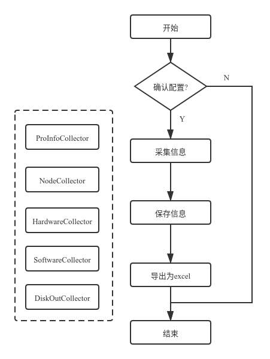

> 从3.3.0版本开始, QCSS采集脚本更名为 conan

# 新特性？

> 实际上这仅仅只是一个脚本型的项目，在我们项目实施交付的最后关头，会使用此脚本收集产品物料信息生成一个excel表格，这个表格会交到售后手中。因此每个项目只会跑这个脚本一次。

- 脚本程序release已经变更为二进制可执行程序，不再对操作系统版本，python版本等产生依赖

- 脚本运行过程采用sqlite进行数据保存汇总，不再使用原本文本作为临时文件

- 增加了开发说明、使用说明等文档

- 引入table窗口格式的输出，提升采集过程中的数据展示可读性

- 引入了脚本运行前的配置确认步骤，减少因配置错误导致的采集问题

- 结合脚本使用场景，移除了对QBackup产品的支持, 产品类型不再需要手工填写，由程序自动读取

- 采用了基于model(存储), serializer(excel导出), collector(采集)的架构模式

# 整体架构



# 核心组件

> 此版本采用sqlalchemy的model进行存储数据，collector实现其中的get_指标方法进行采集, serializer对model中的数据进行筛选并制作成excel的sheet

## Model

此模块实际就是sqlalchemy的数据模型，项目中将每一个sheet定义为一个model，唯一不同的是，为每个实例实现了一个`show`方法

- `show` 基于 `prettytable` 的显示工具，以表格形式展示每一条数据记录

## Serializer

### BaseSerializer

此基类实现了将数据库中的记录导出为excel的功能，对于一个model来说，只需要继承此类，指定其中的三个类属性即可完成任意model的快速导出为excel

```
__model__: BaseModel = None
__fields__ = (("", "xx"),)
__sheet__: AnyStr = ""
```

- `__model__` 指定了在model中定义的sheet类

- `__fields__` 指定了model中需要导出的字段以及对应表头，如果不指定表头，则默认从model字段的doc参数取

- `__sheet__` 指定了excel中sheet的名称，如果不指定则取model的__tablename__属性

- `get_queryset` 此方法返回一个model的实例集合，也就是需要导出的数据集合，默认为model所有数据，如果需要筛选请在子类覆盖此方法

- `get_sheet` 此方法返回一个workbook的sheet对象，可以对sheet对象进行读写,一般无需修改

- `write_title` 此方法实现了从`__fields__`或者从model的doc读取并在sheet中写入表头的逻辑

- `write_data` 此方法接收`get_queryset`返回的数据集合并按照`__fields__`字段规则写入sheet

- `serialize` 此方法将以上方法进行组合，实现了将数据库中数据导出为excel的逻辑

## Collector

### BaseCollector

> 采集某一个sheet时只需要继承此类，指定model_class和serializer_class，然后实现get_{field}方法即可

```
# 需要保存到的model类
model_class: BaseModel.__class__ = None
# 需要序列化的类
serializer_class: BaseSerializer.__class__ = None
```

- 类属性 `model_class` 指定了需要采集的model类

- 类属性 `serializer_class` 指定了导出为excel时需要使用的序列化类

- `exe` 此方法利用`os.popen`和`paramiko`实现了在远程或本地执行shell命令,得到执行结果

- `serialize` 此方法将会调用类属性指定的序列化器类对数据表进行导出

- `collect` 此方法实现了自动寻找实例的 `get_字段`方法进行调用, 用以采集具体信息并保存

- `close` 此方法在采集结束时调用，用以关闭ssh连接或数据库session

# 开发和构建

> 打包方法, 项目整体放到拥有docker环境的机器，make build 进行构建，成功后将在项目下release中得到一个压缩包

## 基于bumpversion的版本号管理

段版本号更新
```
pip install bumpversion

bumpversion major

bumpversion minor

bumpversion patch

bumpversion release
```

## 基于virtualenvwrapper, pip-tools的开发环境构建

- requirements.txt
- requirements.txt.lock

## 基于docker的容器化构建

- conda环境，解决pyinstaller打包出来的二进制文件缺少GLIB问题
- 在项目下release临时挂载到容器内部，构建完得到压缩包

## 基于invoke的常用命令

- inv clean

用于清理一些临时文件或无用文件

- inv install

用于下载项目所需的三方包

参考： [virtualenvwrapper 包管理](https://www.lujianxin.com/x/art/5vj43raevyt4)

- inv lock

用于导出并锁定当前python环境中的包和hash值

- inv version

用于更新软件到任意版本号

```
inv version <new_version>
```


# TODO

- switch 信息采集

- flash 信息采集

- 多线程处理?

